<!-- ============================================================
     RUDRA PATEL — GitHub Profile README
     Before publishing: replace RudraPatel-CS everywhere
     (see SETUP.md for the one-line command that does it)
     ============================================================ -->

  

  

  
  
  

## 🖥️ Live recon

  

## ⚔️ Arsenal

  
    
  
  
  
  
   
  
  
  
  

## 🚩 Featured operations

<table>
<tr>
<td width="50%" valign="top">

<h3 align="center">🛡️ DhanRakshak</h3>

<em>Check before you trust — a financial scam guardian for Bharat</em>

  
  

Paste any suspicious SMS, link, screenshot or call recording — it catches the scam, highlights the red flags on the message itself, and explains **why** in plain **Gujarati, Hindi or English**, quoting real RBI/NPCI advisories.

- 📵 Runs fully **on-device, works offline** — messages never leave your hand
- 🎭 **Practice mode**: a voice scammer calls you, a coach teaches you to hang up
- 🧠 A small on-device model decides; the LLM only explains — private and honest by design

🏆 Maverick Effect AI Challenge 2026 (GTU × Dewang Mehta Foundation) — Round 1 cleared Built with <a href="https://github.com/Het161">Het Patel</a> &amp; Darshan Mistry

</td>
<td width="50%" valign="top">

<h3 align="center">📰 TAAR</h3>

<em>The wire that writes itself — an autonomous AI wire service</em>

  
  

A single AI editor runs an entire wire service: give it a persona once and it **finds its own stories, judges the desk, spikes what fails (and says why), and files dispatches for days** — no human in the loop.

- 🔄 Discover → Judge → File cycle every 30 minutes, publishing nothing most cycles
- 🧾 Every dispatch ships with sources + an editor's rationale naming what it beat
- 🔌 Public API: `init` a persona, poll its feed forever

⚡ ABTalks Vibe-Code Hackathon 2026 — Team DriftLock Built with <a href="https://github.com/Het161">Het Patel</a>

</td>
</tr>
</table>

## 🔐 Security work

<b>CodeAlpha — Cybersecurity Internship (completed ✅) — click to expand</b>

 

| Task | What I built |
|------|--------------|
| 🕵️ **Network Sniffer** | Python + **Scapy** tool capturing live traffic in real time — source/destination IPs, TCP/UDP/ICMP identification, port extraction, timestamped logs <!-- ADD REPO LINK --> |
| 🎣 **Phishing Awareness Training** | Full training deck: how phishing works, spotting fake emails and sites, social-engineering tactics, real-world examples + interactive quizzes <!-- ADD REPO LINK --> |
| 🔎 **Secure Code Review** | Line-by-line audit of a Python/Flask portal — **10 vulnerabilities** documented (SQLi, command injection, insecure deserialization, IDOR, XSS, path traversal, CSRF…), each mapped to **CWE + OWASP Top 10 (2021)**, with a fully remediated build <!-- ADD REPO LINK --> |

 

  
  
🥇 <b>Golden League — Rank #1</b> · Rooms cleared: Blue (EternalBlue MS17-010) · Moniker Link (CVE-2024-21413) · LLMborghini (prompt injection) · Metasploit · AI/ML Security Threats

## 📊 Field stats

  
  

  

  

## 🐍 The snake eats my contributions

  <picture>
    <source media="(prefers-color-scheme: dark)" srcset="https://raw.githubusercontent.com/RudraPatel-CS/RudraPatel-CS/output/github-snake-dark.svg" />
    
  </picture>

## 📡 Reach me

  
  
  <!-- ADD EMAIL:  -->

  

